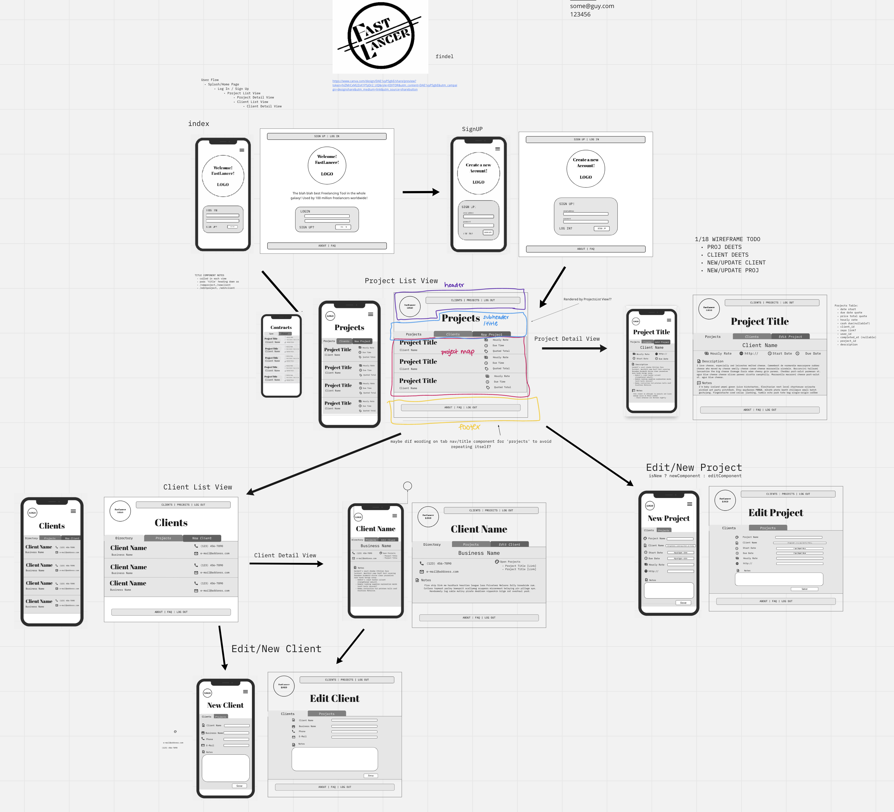

# **Fast-Lancer**
## *A Freelancer's All-In-One Business Manager*

Fast-Lancer utilizes a RESTful API and CRUD functionality as a freelancer's organizational solution, tracking pertinent data relating to open contracts and current clients. 

Fast-Lancer was created with independent artists and craftspeople in mind, and was planned to integrate a clean, minimal UI within an extremely functional, all purpose framework. Our goal was to build an easily navigable app with a wide swath of applications and use cases. Another top priority was to build a practical, flexible business tool with an emphasis on utility and scalability.

Fast-Lancer offers a clean, straightforward solution for freelancers to organize their projects, track their hours and their client relationships. Scalable possibilities include income and tax tracking, productivity graphing, invoice creation and export amongst many others.

**Stack:**
* REACT
* REACT ROUTER
* JSX
* CSS3
* POSTCSS
* HTML
* SUPABASE
* JEST
* @TESTING-LIBRARY
* MSW
* YARN
* BABEL
* CREATE-REACT-APP

## *Planning*

### Miro Board + Kanban

[Miro](https://miro.com/app/board/uXjVOV_R32M=/?invite_link_id=386561781378)

### Deployed:

[https://fast-lancer.netlify.app](https://fast-lancer.netlify.app ) 

## *Team*

[Taylor Williams](https://github.com/taylor-c-williams)

[Zack Lyon](https://github.com/ZackLyon)

[Dylan FLoyd](https://github.com/Dylan-Floyd)

## *Wireframes, User Flow*

